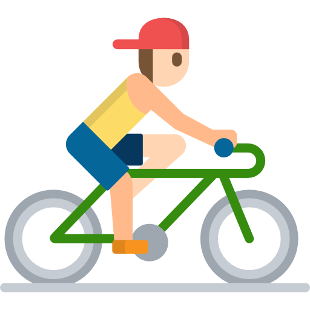
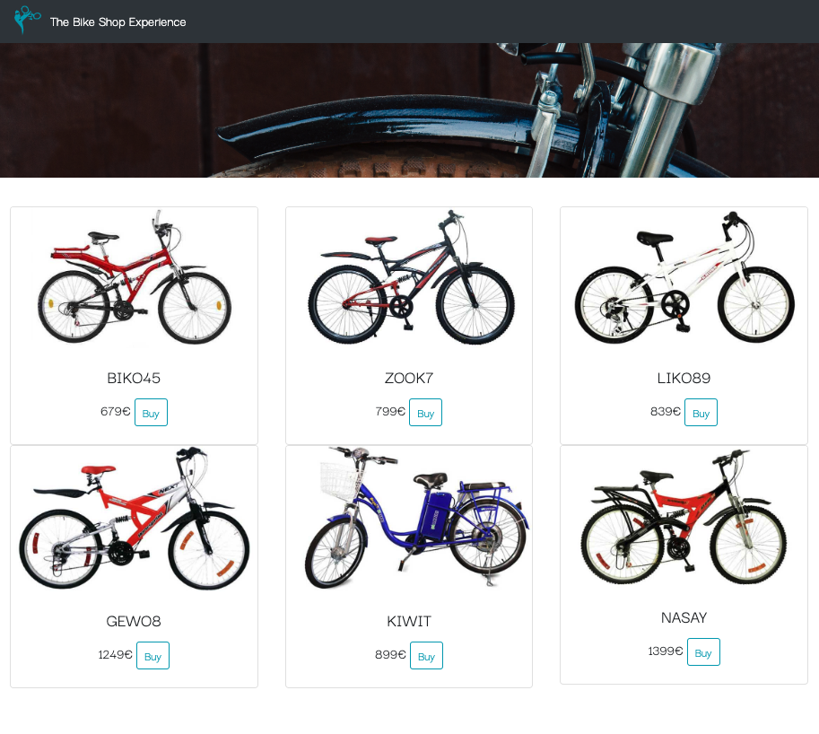

<div align="center" id="top"> 
  

  &#xa0;

  <!-- <a href="https://bikeshop.netlify.app">Demo</a> -->
</div>

<h1 align="center">Bikeshop</h1>

<p align="center">
  
  
  
  

  <!--  -->

  <!--  -->

  <!--  -->
</p>

<!-- Status -->

<!-- <h4 align="center"> 
	🚧  Bikeshop 🚀 Under construction...  🚧
</h4> 

<hr> -->

<p align="center">
  <a href="#dart-about">About</a> &#xa0; | &#xa0; 
  <a href="#sparkles-features">Features</a> &#xa0; | &#xa0;
  <a href="#rocket-technologies">Technologies</a> &#xa0; | &#xa0;
  <a href="#white_check_mark-requirements">Requirements</a> &#xa0; | &#xa0;
  <a href="#checkered_flag-starting">Starting</a> &#xa0; | &#xa0;
  <a href="#memo-license">License</a> &#xa0; | &#xa0;
  <a href="https://github.com/{{YOUR_GITHUB_USERNAME}}" target="_blank">Author</a>
</p>

<br>


## :dart: About ##

E-commerce website for the sale of bicycles.

## :sparkles: Features ##

:heavy_check_mark: responsive user interface\
:heavy_check_mark: manage a product catalog\
:heavy_check_mark: setting up a shopping cart:\                      
- add products
- modify the quantity
- delete a product
- calculate a total amount of the cart
- integrate a payment method with Stripe
## :rocket: Technologies ##

The following tools were used in this project:

- [Node.js](https://nodejs.org/en/)
- [Express](https://expressjs.com/)
- [Bootstrap](https://getbootstrap.com/)

## :white_check_mark: Requirements ##

Before starting :checkered_flag:, you need to have [Git](https://git-scm.com) and [Node](https://nodejs.org/en/) installed.

## :checkered_flag: Starting ##

```bash
# Clone this project
$ git clone https://github.com/NDRBAX/bikeshop

# Access
$ cd bikeshop

# Install dependencies
$ npm i

# Run the project
$ npm start

# The server will initialize in the <http://localhost:3000>
```

## :memo: Credits ##

Project logo : <a href="https://www.flaticon.com/free-icons/bike" title="bike icons">Bike icons created by Freepik - Flaticon</a>\
Project realized during the <a href="https://www.lacapsule.academy/">La Capsule Academy</a> bootcamp\
Made with :heart: by <a href="https://github.com/NDRBAX" target="_blank">NDRBAX</a>

&#xa0;

<a href="#top">Back to top</a>
